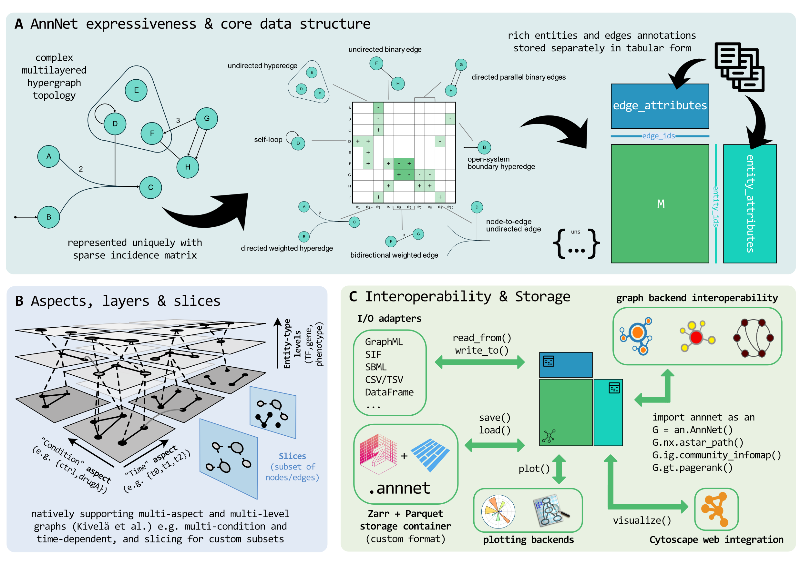

  
Typed graph data for complex networks

  <h1>annnet</h1>
  

    annnet is a lightweight Python container for heterogeneous graph data. It represents simple graphs, directed and signed networks, hypergraphs, multilayer structures, and edge-entity relations in one model, with typed annotations, named slices, and a native storage format.
  

## Why annnet

Many real-world networks are structurally heterogeneous and context-dependent. A single dataset may combine
directed and undirected interactions, signed edges, higher-order relations, and multiple experimental or temporal
conditions. Standard graph libraries handle topology and algorithms well, but typically treat attributes as flat,
per-object dictionaries without schema, indexing, or efficient bulk operations. This makes it difficult to manage
annotations, compare conditions, or preserve structure across analysis steps.

annnet addresses this by defining a single container that keeps graph topology, annotation tables, and graph views
aligned. The goal is not to replace existing graph libraries, but to provide a consistent data model that can express
complex networks and still interoperate with established tooling.

At the core is a sparse incidence-based representation that supports mixed graph types within the same object.
Edges are first-class entities with stable identifiers, and graph type (directed, undirected, hyperedge) is a
property of each edge rather than the container. Around this core, annnet organizes metadata as typed tables and
exposes higher-level constructs such as slices and multilayer structure without duplicating the underlying graph.

-   __One object for heterogeneous graphs__

    ---

    Represent simple graphs, digraphs, signed edges, hyperedges, self-loops, parallel edges, and edge-entity relations without switching data models.

-   __Typed annotation tables__

    ---

    Store vertex, edge, slice, layer, and edge-slice metadata in indexed tabular structures instead of flat per-object dictionaries.

-   __Named slices for conditions and views__

    ---

    Define condition-specific or context-specific graph views without copying the full topology, with optional per-slice edge-weight overrides.

-   __Multilayer network support__

    ---

    Work with aspects, layer tuples, vertex-layer membership, intra-layer edges, inter-layer edges, and coupling structure as part of the core model.

-   __Interoperability without losing the source of truth__

    ---

    Convert lazily to existing graph libraries when needed, while keeping annnet as the canonical representation.

-   __Native, loss-aware storage__

    ---

    Persist topology, annotations, and metadata together in a format designed for round-trip fidelity and scalable IO.

## What annnet is built for

annnet is most useful in settings where graph structure is only one part of the data model, and where annotations,
conditions, or multiple representations must be handled explicitly. The design follows patterns that have proven
useful in other domains (for example, matrix-plus-annotation containers in omics, in AnnData), but adapts them to
graphs with heterogeneous topology.

Instead of encoding these requirements through ad hoc conventions or multiple loosely coupled objects, annnet
keeps them within a single, consistent representation that can still be exported or adapted when needed.

-   __Systems biology and omics integration__

    ---

    Model regulatory, signaling, metabolic, and cross-modal networks with typed metadata and multiple experimental contexts.

-   __Condition-specific and temporal networks__

    ---

    Keep one shared graph with named slices for perturbations, time points, cohorts, or filtered analytical views.

-   __Multimodal and layered data__

    ---

    Represent networks across modalities, resolutions, or time as explicit multilayer objects rather than ad hoc conventions.

-   __Exchange with existing tooling__

    ---

    Move between annnet and standard graph ecosystems, file formats, and ML pipelines without flattening the original structure too early.

## Documentation

The documentation is structured around how the package is typically used: first understanding the model, then
working through examples, and finally consulting the API in detail. Check out the documentation sections below:

-   __Tutorials and notebooks__

    ---

    End-to-end examples showing graph construction, annotation workflows, slices, multilayer models, and interoperability.

    [Open tutorials](tutorials/index.md)

-   __Concepts and design__

    ---

    Explanations of the incidence-matrix core, annotation system, slices, multilayer formalism, adapters, and storage model.

    [Open explanations](explanations/index.md)

-   __API reference__

    ---

    Detailed reference for the object model, bulk APIs, IO, utilities, and public entry points.

    [Open reference](reference/index.md)

-   __Community__

    ---

    Contribution guidance for documentation, package development, and project standards.

    [Open community pages](community/index.md)

## Start with the workflow you need

The entry points below correspond to common usage patterns. Installation is the minimal setup path, the quickstart
introduces the core object and data model, and the tutorial walks through a complete example with annotations,
hypergraph structure, and layers.

  
Get started

  <h2>Install annnet, build a toy AnnNet graph, or inspect a full biological example</h2>
  

    Start with installation if you are setting up the package, the quickstart if you want the core object model,
    or the tutorial if you want a complete worked example with annotations and graph structure.
  

  

    <a class="md-button md-button--primary" href="installation/">Installation</a>
    <a class="md-button" href="quickstart/">Quickstart</a>
    <a class="md-button" href="tutorials/">Tutorial</a>
  

