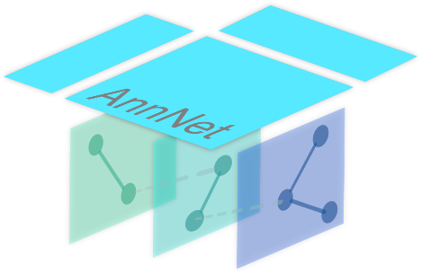

<div class="sv-hero">
<div class="sv-hero-grid">
  
  <div class="sv-hero-text">
  <div class="sv-kicker">Annotated data structure for complex networks</div>
  <h1>annnet</h1>
  <p class="sv-lead">
    annnet (Annotated Network) is a high-expressivity data structure for
    networks. One container holds simple graphs, multilayer networks and
    hypergraphs, together with their annotations. It is designed for systems
    biology, network biology, omics integration, computational social science,
    and any domain that needs fully flexible graph semantics, with stable
    storage and interoperability.
  </p>
  </div>
</div>
</div>

## Get started

### 1. Install

```bash
pip install "annnet[polars,networkx,storage]"
```

This installs annnet with the Polars tables, the NetworkX backend and the native
file format. The core package alone is `pip install annnet`. For all optional
extras, see [Installation](installation.md).

### 2. Try it

Build a small signaling network from a table, select the confident
interactions, run a NetworkX algorithm on the same object, and save the result:

```python
import annnet as an
import polars as pl

interactions = pl.DataFrame(
    {
        'source': ['EGFR', 'GRB2', 'SOS1', 'KRAS', 'BRAF', 'PTEN'],
        'target': ['GRB2', 'SOS1', 'KRAS', 'BRAF', 'MAPK1', 'AKT1'],
        'sign': [1, 1, 1, 1, 1, -1],
        'confidence': [0.95, 0.9, 0.8, 0.9, 0.7, 0.85],
    }
)

G = an.from_edge_frame(interactions, sign='sign', directed=True)
print(G.summary())  # 8 nodes, 6 edges

confident = G.view(edges=G.E.select(confidence__gte=0.85))
print(len(confident.N), len(confident.E))  # 7 nodes, 4 edges

scores = G.nx.betweenness_centrality(G)
G.attrs.update('nodes', {n: {'betweenness': v} for n, v in scores.items()})

G.write('signaling.annnet')
G2 = an.read('signaling.annnet')
```

The [Quickstart](quickstart.md) goes through the same steps with a larger
table, and explains views, annotations and the saved file.

### 3. Learn more

- **Guide**, five notebooks with concepts, mathematics and runnable code:
  [graph model and matrices](guide/graph-model.ipynb) ·
  [annotations and views](guide/annotations-and-views.ipynb) ·
  [slices](guide/slices.ipynb) ·
  [layers](guide/layers.ipynb) ·
  [computation and storage](guide/computation-and-storage.ipynb)
- **Examples**, complete analyses:
  [multi-condition causal signaling](examples/use_cases/UC1.ipynb) ·
  [TGF-beta fibrosis response](examples/use_cases/UC2.ipynb),
  and integrations with
  [OmniPath](examples/scenarios/omnipath_table_ingestion.ipynb),
  [Cytoscape](examples/scenarios/cytoscape_cx2_export.ipynb),
  [PyG](examples/scenarios/pyg_heterodata_export.ipynb) and
  [CORNETO](examples/scenarios/causal_activity_bridge.ipynb)
- **[API reference](reference/index.md)**: exact signatures and options
- **[Community](community/index.md)**: how to contribute to the docs and the code

## Main features


At the core is a sparse incidence-based representation that supports mixed
graph types within the same object. Edges are first-class entities with stable
identifiers, and graph type (directed, undirected, hyperedge) is a property of
each edge rather than the container. Around this core, annnet organizes
metadata as typed tables and exposes higher-level constructs such as slices and
multilayer structure without duplicating the underlying graph.

<div class="grid cards annnet-feature-cards" markdown>

-   __One object for heterogeneous graphs__

    ---

    Represent simple graphs, digraphs, signed edges, hyperedges, self-loops, parallel edges, and edge-entity relations without switching data models.

    See: [hyperedges in the guide](guide/graph-model.ipynb#when-a-pair-of-endpoints-is-insufficient) ·
    [edge as an endpoint](guide/graph-model.ipynb#an-edge-as-an-endpoint) ·
    [adding edges](reference/core/adding-edges.md)

-   __Typed annotation tables__

    ---

    Store node, edge, slice, layer, and edge-slice metadata in indexed tabular structures instead of flat per-object dictionaries.

    See: [annotations in the guide](guide/annotations-and-views.ipynb#import-identities-and-annotations) ·
    [OmniPath table example](examples/scenarios/omnipath_table_ingestion.ipynb) ·
    [attributes](reference/core/attributes.md)

-   __Named slices for conditions and views__

    ---

    Define condition-specific or context-specific graph views without copying the full topology, with optional per-slice edge-weight overrides.

    See: [slices in the guide](guide/slices.ipynb#what-a-slice-represents) ·
    [multi-condition example](examples/use_cases/UC1.ipynb) ·
    [slices](reference/core/slices.md)

-   __Multilayer network support__

    ---

    Work with aspects, layer tuples, node-layer membership, intra-layer edges, inter-layer edges, and coupling structure as part of the core model.

    See: [layers in the guide](guide/layers.ipynb#the-coordinate-model) ·
    [supra-adjacency](guide/layers.ipynb#supra-adjacency-and-its-blocks) ·
    [layers](reference/core/layers.md)

-   __All popular graph libraries, without conversion work__

    ---

    Run NetworkX, igraph, and graph-tool algorithms directly on an annnet graph through `G.nx`, `G.ig`, and `G.gt`. annnet converts lazily and stays the canonical representation.

    See: [backends in the guide](guide/computation-and-storage.ipynb#make-the-algorithm-input-explicit) ·
    [PyG example](examples/scenarios/pyg_heterodata_export.ipynb) ·
    [backend accessors](reference/core/backend-accessors.md)

-   __Native, loss-aware storage__

    ---

    Persist topology, annotations, and metadata together in a format designed for round-trip fidelity and scalable IO.

    See: [storage in the guide](guide/computation-and-storage.ipynb#persistence-and-reconstruction-channels) ·
    [Cytoscape example](examples/scenarios/cytoscape_cx2_export.ipynb) ·
    [format comparison](reference/io/format-comparison.md)

</div>

## Why annnet

Many real-world networks are structurally heterogeneous and context-dependent.
A single dataset may combine directed and undirected interactions, signed edges,
higher-order relations, and multiple contextual or temporal conditions.
Standard graph libraries handle topology and algorithms well, but typically
treat attributes as flat, per-object dictionaries without schema, indexing, or
efficient bulk operations. This makes it difficult to manage annotations,
compare conditions, or preserve structure across analysis steps.

annnet keeps graph topology, annotation tables, and graph views aligned in a
single container. It does not replace the existing graph libraries: it makes
the most popular ones (NetworkX, igraph, graph-tool) available on the same
object, and exchanges data with formats and tools such as Cytoscape, GraphML,
SBML, and PyTorch Geometric. You keep one consistent data model and still use the established
tooling.

The design follows the matrix-plus-annotation pattern of omics containers such
as AnnData, and adapts it to graphs with heterogeneous topology. annnet is most
useful where graph structure is only one part of the data model, and where
annotations, conditions, or multiple representations must be handled
explicitly:

<div class="grid cards annnet-feature-cards" markdown>

-   __Systems biology and omics integration__

    ---

    Model regulatory, signaling, metabolic, and cross-modal networks with typed metadata and multiple analysis contexts.

    See: [TGF-beta fibrosis example](examples/use_cases/UC2.ipynb)

-   __Condition-specific and temporal networks__

    ---

    Keep one shared graph with named slices for perturbations, time points, cohorts, or filtered analytical views.

    See: [slices in the guide](guide/slices.ipynb#work-on-one-condition) ·
    [multi-condition example](examples/use_cases/UC1.ipynb)

-   __Multimodal and layered data__

    ---

    Represent networks across modalities, resolutions, or time as explicit multilayer objects rather than ad hoc conventions.

    See: [several aspects and windows](guide/layers.ipynb#several-aspects-and-an-ordered-window)

-   __Exchange with existing tooling__

    ---

    Move between annnet and standard graph ecosystems, file formats, and ML pipelines without flattening the original structure too early.

    See: [Cytoscape](examples/scenarios/cytoscape_cx2_export.ipynb) ·
    [PyG](examples/scenarios/pyg_heterodata_export.ipynb) ·
    [CORNETO](examples/scenarios/causal_activity_bridge.ipynb)

</div>
